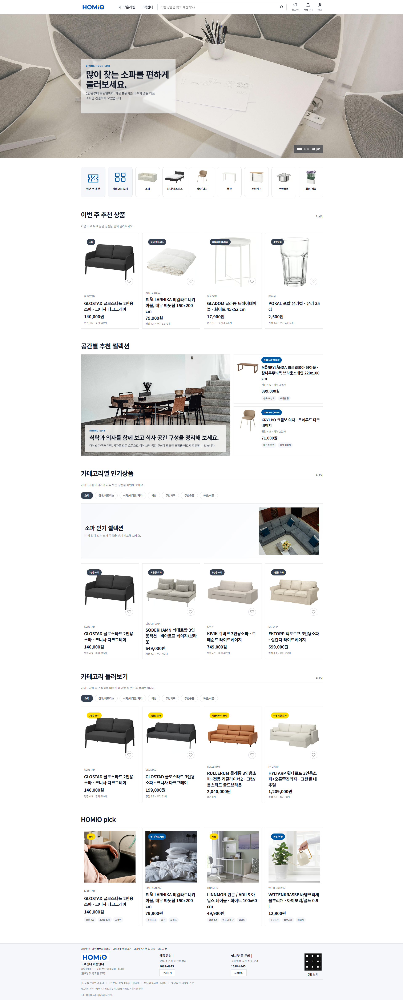
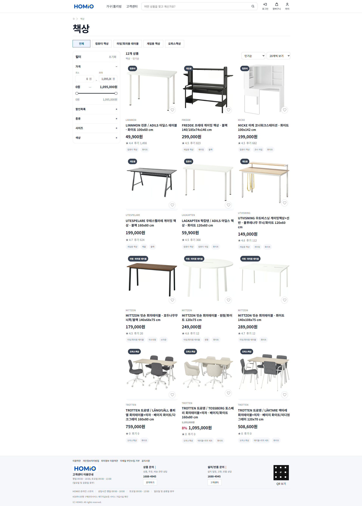
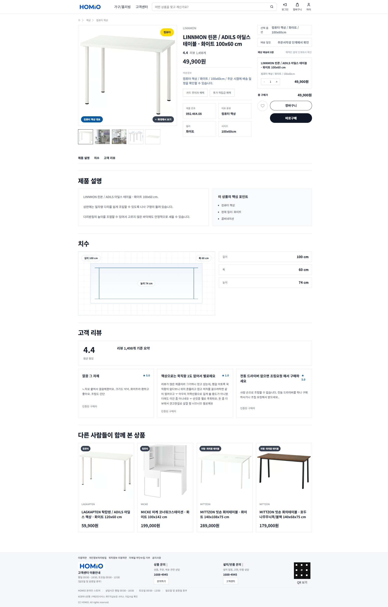
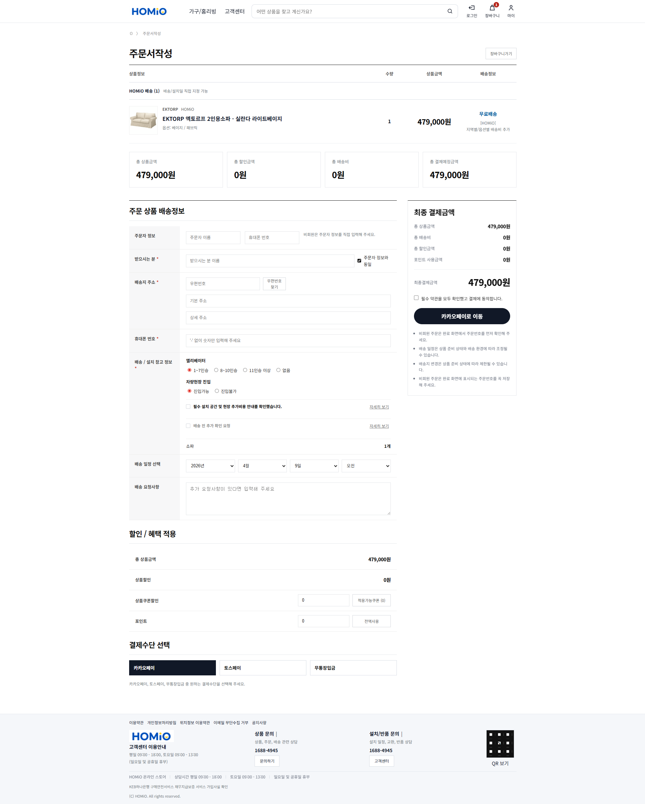
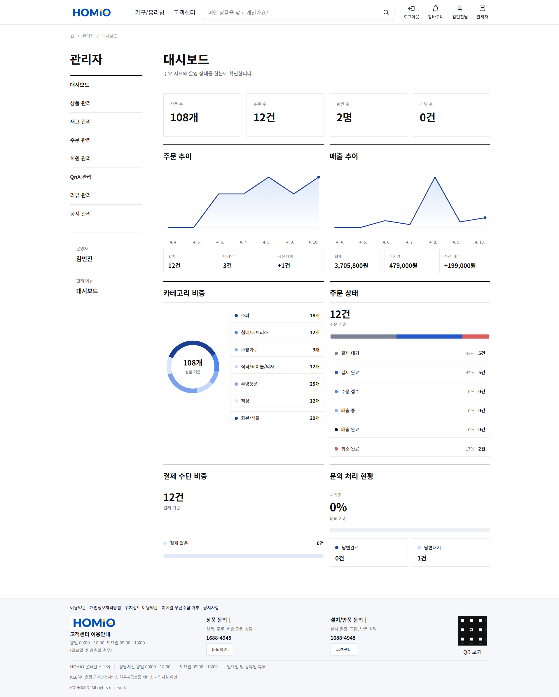
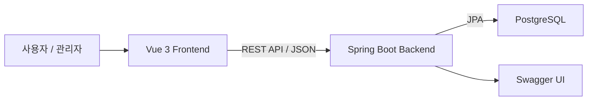
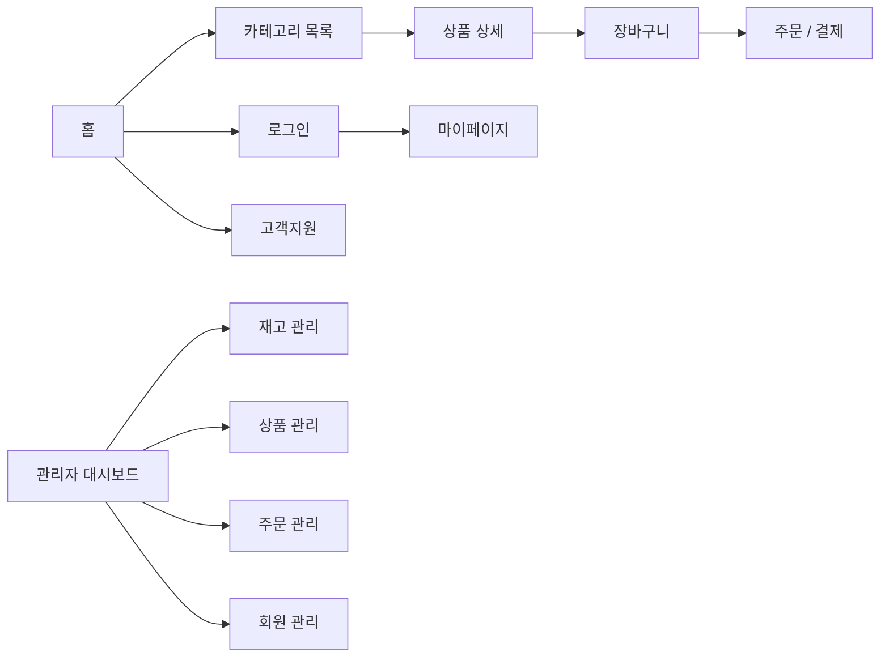

# 가구 쇼핑몰 웹 애플리케이션

가구 탐색부터 장바구니, 주문, 고객지원, 관리자 운영까지 하나의 흐름으로 연결한 가구 쇼핑몰 웹 애플리케이션 프로젝트입니다.

## 프로젝트 개요

- 프로젝트명: 가구 쇼핑몰 웹 애플리케이션
- 개발 기간: 2026.03.14 ~ 2026.04.12
- 개발 인원: 2명
- 개발 방식: 프론트엔드/백엔드 분리형 웹 애플리케이션
- 저장소: [teamweb803/teamweb02](https://github.com/teamweb803/teamweb02)
- 산출물: [Notion 문서 모음](https://www.notion.so/de296acf563f838584b301756ee05b67)

## 팀 구성

| 이름 | 역할 |
| --- | --- |
| 김민진(팀장) | 프론트엔드 구현, UI 흐름 설계, 종합 검수 |
| 박재웅 | 백엔드 및 DB 설계, 구현 |
| 공통 작업 | 요구사항 정리, 산출물 작성, 테스트 및 문서화 |

## 핵심 기능

- 비회원, 회원, 관리자 권한을 분리한 쇼핑몰 서비스
- 카테고리별 상품 조회, 검색, 상세 조회, 추천 상품 구성
- 회원/비회원 장바구니 및 주문 흐름 지원
- 주문 생성, 주문 조회, 주문 상태 관리
- JWT 기반 인증과 회원 정보 관리
- 리뷰, QnA, 공지사항 기반 고객지원 기능
- 관리자 대시보드, 상품 관리, 재고 관리, 회원/주문/리뷰/QnA/공지 관리
- Swagger 기반 API 문서 확인 및 테스트 지원

## 기술 스택

### Frontend

- Vue 3
- JavaScript
- Vite
- Vue Router
- Pinia
- Axios

### Backend

- Java 21
- Spring Boot 3
- Spring Security
- Spring Data JPA
- JWT
- WebFlux

### Database / Infra

- PostgreSQL
- Docker / Docker Compose
- Git / GitHub
- Swagger(OpenAPI)

## 실행 화면

| 홈 | 카테고리 |
| --- | --- |
|  |  |

| 상품 상세 | 주문/결제 |
| --- | --- |
|  |  |

| 관리자 대시보드 |
| --- |
|  |

## 시스템 아키텍처



## 사용자 흐름



## 프로젝트 구조

### Frontend

```text
ikea-frontend/
├── public/
├── src/
│   ├── assets/
│   ├── components/
│   ├── composables/
│   ├── constants/
│   ├── data/
│   ├── libs/
│   ├── mappers/
│   ├── router/
│   ├── services/
│   ├── stores/
│   └── views/
├── package.json
└── vite.config.js
```

### Backend

```text
ikea-backend/
├── src/main/java/com/example/ikea/
│   ├── config/
│   ├── controller/
│   ├── domain/
│   ├── dto/
│   ├── repository/
│   ├── security/
│   └── service/
├── src/main/resources/
├── build.gradle
└── Dockerfile
```

## API / 문서 / 테스트

- Base URL: `/api`
- Swagger UI: `/swagger-ui/index.html`
- OpenAPI Docs: `/v3/api-docs`
- API 문서는 인증/회원, 상품, 장바구니, 주문, 결제, 리뷰, QnA, 공지, 관리자 API 기준으로 정리
- 실브라우저 기준 테스트 59건 수행, PASS 59 / FAIL 0 / BLOCKED 0

## 로컬 실행

### 1. Backend

```bash
cd ikea-backend
./gradlew bootRun
```

기본 백엔드 포트: `8402`

### 2. Frontend

```bash
cd ikea-frontend
npm install
npm run dev
```

기본 프론트엔드 포트: `5173`

### 3. Database

PostgreSQL 사용 기준

- DB 이름: `ikea`
- 사용자: `postgres`
- 비밀번호: `1234`

## Docker 이미지

- Frontend: [kimmj6466/team4-frontend:1.0](https://hub.docker.com/r/kimmj6466/team4-frontend)
- Backend: [kimmj6466/team4-backend:1.0](https://hub.docker.com/r/kimmj6466/team4-backend)
- Database: [kimmj6466/team4-db:1.0](https://hub.docker.com/r/kimmj6466/team4-db)

## 산출물 링크

- [프로젝트 개요서](https://www.notion.so/59396acf563f830e930d0147b8ba7127)
- [기능 명세서](https://www.notion.so/af696acf563f82b88664014278fcf455)
- [화면 설계서](https://www.notion.so/49996acf563f832b8d0681261202a3f8)
- [API 명세서](https://www.notion.so/eb496acf563f83bb945b01b383afca9f)
- [프로젝트 구조도](https://www.notion.so/28996acf563f82aa830d01c89bd6acee)
- [테스트 문서](https://www.notion.so/6dc96acf563f8286963d01d295a364ca)
- [Swagger 연동 기준](https://www.notion.so/66c96acf563f8344b82181bb2694f489)
- [배포 가이드](https://www.notion.so/5c296acf563f83c6aced018e71fb7004)
