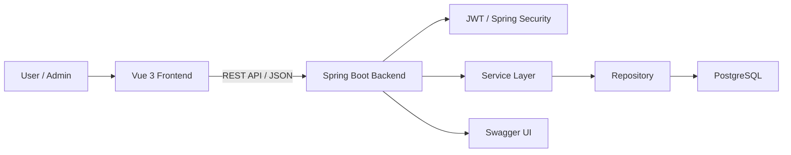
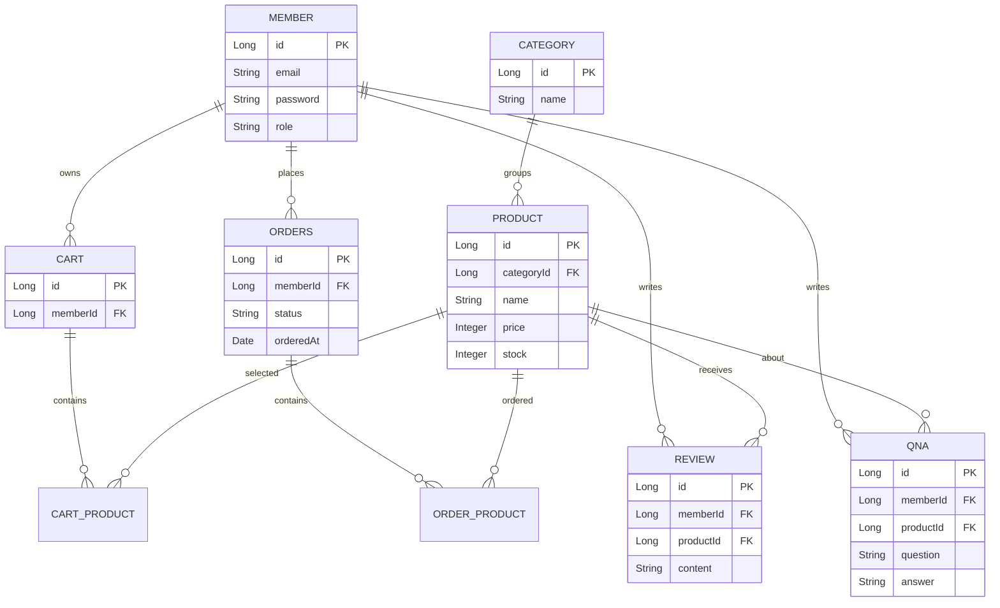

# IKEA Shopping Mall Team Project

가구 탐색부터 장바구니, 주문, 고객지원, 관리자 운영까지 하나의 흐름으로 연결한 Vue 3 + Spring Boot 기반 쇼핑몰 팀 프로젝트입니다. 백엔드와 DB 설계, API 구현, Swagger 문서화, 실브라우저 테스트 산출물을 중심으로 정리했습니다.

## 1. 프로젝트 개요

- 프로젝트명: IKEA Shopping Mall Team Project
- 개발 기간: 2026.03.14 ~ 2026.04.12
- 개발 인원: 2명
- 개발 방식: 프론트엔드/백엔드 분리형 웹 애플리케이션
- 저장소: https://github.com/teamweb803/teamweb02
- 산출물: https://www.notion.so/de296acf563f838584b301756ee05b67

## 2. 주요 기능

- 비회원, 회원, 관리자 권한 분리
- 카테고리별 상품 조회, 검색, 상세 조회, 추천 상품 구성
- 회원/비회원 장바구니 및 주문 흐름
- 주문 생성, 주문 조회, 주문 상태 관리
- JWT 기반 인증과 회원 정보 관리
- 리뷰, QnA, 공지사항 기반 고객지원 기능
- 관리자 대시보드, 상품/재고/회원/주문/리뷰/QnA/공지 관리
- Swagger 기반 API 문서 확인 및 테스트

## 3. 담당 역할

| 이름 | 역할 |
| --- | --- |
| 김민진 | 프론트엔드 구현, UI 흐름 설계, 종합 검수 |
| 박재웅 | 백엔드 및 DB 설계, Spring Boot API 구현 |
| 공통 | 요구사항 정리, 산출물 작성, 테스트 및 문서화 |

박재웅 담당 상세:

- controller, service, repository, dto, domain 계층 기반 API 구성
- JWT 인증, 회원, 상품, 장바구니, 주문, 리뷰, QnA, 공지, 관리자 API 구현 참여
- PostgreSQL 기반 DB 설계 및 JPA entity 관계 정리
- Swagger API 문서화와 실브라우저 테스트 산출물 정리 참여
- 팀원과 화면 흐름, API 계약, DTO 필드명을 맞추며 통합 검수

## 4. 기술 스택

| 영역 | 기술 |
| --- | --- |
| Frontend | Vue 3, JavaScript, Vite, Vue Router, Pinia, Axios |
| Backend | Java 21, Spring Boot 3, Spring Security, Spring Data JPA, JWT, WebFlux |
| Database | PostgreSQL |
| Infra | Docker, Docker Compose |
| Docs/Test | Swagger(OpenAPI), Notion, Browser Test |

## 5. 시스템 아키텍처



## 6. ERD



실제 entity는 `ikea-backend/src/main/java/com/example/ikea/domain` 기준입니다. README ERD는 핵심 관계 요약입니다.

## 7. API 명세

- Base URL: `/api`
- Swagger UI: `/swagger-ui/index.html`
- OpenAPI Docs: `/v3/api-docs`

| 도메인 | 주요 기능 |
| --- | --- |
| Auth / Member | 회원가입, 로그인, 회원 정보 조회/수정, JWT 인증 |
| Product / Category | 상품 목록, 상세, 카테고리별 조회, 추천 상품 |
| Cart | 장바구니 추가, 조회, 수량 변경, 삭제 |
| Order / Payment | 주문 생성, 주문 조회, 주문 상태 관리, 결제 흐름 |
| Review | 리뷰 작성, 조회, 수정, 삭제 |
| QnA / Notice | 문의와 공지사항 CRUD |
| Admin | 대시보드, 상품/재고/회원/주문/리뷰/QnA/공지 관리 |

전체 요청/응답 스키마는 Swagger UI와 Notion API 명세서를 기준으로 확인합니다.

## 8. 실행 방법

Backend:

```bash
cd ikea-backend
./gradlew bootRun
```

기본 백엔드 포트: `8402`

Frontend:

```bash
cd ikea-frontend
npm install
npm run dev
```

기본 프론트엔드 포트: `5173`

PostgreSQL 기준:

- DB 이름: `ikea`
- 사용자: `postgres`
- 비밀번호: `1234`

## 9. 테스트 / 검증 방법

- Swagger UI에서 인증/회원, 상품, 장바구니, 주문, 리뷰, QnA, 공지, 관리자 API 확인
- 실브라우저 기준 테스트 59건 수행: PASS 59 / FAIL 0 / BLOCKED 0
- 비회원/회원/관리자 권한별 접근 가능 화면 확인
- 장바구니 → 주문/결제 → 주문 조회 흐름 확인
- 관리자 상품/재고/회원/주문 관리 화면 검수

## 10. 트러블슈팅

- 프론트엔드와 백엔드가 분리되어 있어 DTO 필드명, 인증 헤더, 에러 응답 형태를 맞추는 과정이 중요했습니다.
- 회원/비회원/관리자 권한이 섞이지 않도록 Spring Security와 라우팅 책임을 분리했습니다.
- 팀원 간 화면 흐름과 API 계약을 Notion/Swagger 기준으로 맞추며 통합 검수를 진행했습니다.
- 테스트 문서 기준 59건 PASS 결과를 제출 증거로 정리했습니다.

## 11. 배포 / 링크

- GitHub: https://github.com/teamweb803/teamweb02
- Notion 문서 모음: https://www.notion.so/de296acf563f838584b301756ee05b67
- DockerHub Frontend: https://hub.docker.com/r/kimmj6466/team4-frontend
- DockerHub Backend: https://hub.docker.com/r/kimmj6466/team4-backend
- DockerHub Database: https://hub.docker.com/r/kimmj6466/team4-db

산출물:

- 프로젝트 개요서
- 기능 명세서
- 화면 설계서
- API 명세서
- 프로젝트 구조도
- 테스트 문서
- Swagger 연동 기준
- 배포 가이드

## 12. 한계와 개선 방향

- 실제 결제 PG 연동과 운영 배포 자동화는 제한적입니다.
- API 자동 테스트와 CI가 부족해 핵심 도메인 테스트 보강이 필요합니다.
- 관리자 통계, 재고 변경 이력, 주문 상태 변경 이력 같은 운영 기능을 확장할 수 있습니다.
- Swagger 문서와 DTO 예시를 더 촘촘히 맞추면 프론트/백엔드 계약 관리가 쉬워집니다.